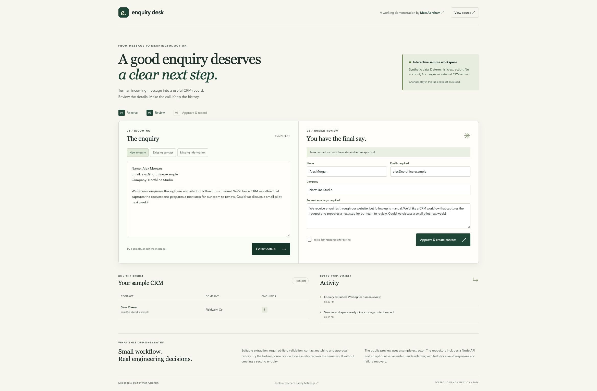
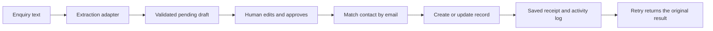

# Enquiry Desk

### An enquiry-to-CRM workflow with a human in the loop

**[Try the live demonstration](https://tbmattnz.github.io/ai-enquiry-crm/)** · [Two-minute walkthrough](WALKTHROUGH.md) · [About Matt Abraham](https://github.com/tbmattnz)



A small portfolio project by **Matt Abraham**, Product & Development Lead at Teacher's Buddy. It demonstrates the kind of focused integration I build: take an enquiry, propose structured details, let a person check them, then create or update a CRM record.

**The public preview uses deterministic sample extraction and an in-memory sample CRM. It does not call an AI service.** The local Node API also supports an optional Claude extraction adapter. Live provider calls have not been tested with a paid account; the adapter is covered by mocked response tests.

## Try it in two minutes

1. Open the demo and select **New enquiry**.
2. Choose **Extract details**. Nothing has been added to the CRM yet.
3. Edit the proposed fields, then approve.
4. Try **Existing contact** to update the seeded contact instead of creating another.
5. Try **Missing information**: approval is blocked until you supply an email.
6. Enable **Test a lost response after saving**, approve, then retry. The original result is returned without another write.

All names, companies and email addresses in the demonstration are fictional. Changes in the hosted preview stay in the tab and reset on reload.

## Run locally — no install or API key needed

Requires Node.js 22 or newer. A compiled React client is included.

```sh
git clone https://github.com/tbmattnz/ai-enquiry-crm.git
cd ai-enquiry-crm
npm start
```

Open **http://127.0.0.1:4317**. The local server starts in sample mode and binds only to the loopback interface.

```sh
npm test
```

Tests use Node's built-in runner. No network services or paid credentials are required.

## Optional live extraction

Set `ANTHROPIC_API_KEY` and `ANTHROPIC_MODEL` in your shell or an untracked `.env` file. Choose a model available to your account. If your key requires a workspace header, also set `ANTHROPIC_WORKSPACE_ID`.

```sh
node --env-file=.env src/server.mjs
```

The interface will say **Live AI · local server**. In this mode, enquiry text is sent to Anthropic and normal provider charges apply. The key is used only on the server. The provider proposes fields; it has no CRM-writing tools. Malformed or incomplete output is rejected before a review can be created.

See [Anthropic's API documentation](https://platform.claude.com/docs/en/api/overview) for account and authentication details.

## Architecture



| File                     | Responsibility                                                        |
| ------------------------ | --------------------------------------------------------------------- |
| `src/app.jsx`            | Application state, workflow actions and transport selection           |
| `src/ReviewPanel.jsx`    | Editable human review and approval states                             |
| `src/Records.jsx`        | CRM table and activity log                                            |
| `src/domain.mjs`         | Validation, draft lifecycle, contact matching and idempotent approval |
| `src/extract.mjs`        | Deterministic sample extractor and optional Claude adapter            |
| `src/server.mjs`         | Local HTTP API, request limits and same-origin checks                 |
| `src/samples.mjs`        | Fictional enquiries and a seeded CRM contact                          |
| `test/workflow.test.mjs` | Domain, provider-boundary and HTTP tests                              |

GitHub Pages runs the domain service directly in the browser. Local server mode uses the same domain logic over HTTP. The CRM adapter here is an in-memory demonstration, not a Salesforce, HubSpot or Kitenga integration.

### Why these choices?

- **Separate extraction from approval.** A plausible model response is not permission to write a record.
- **Validate on the backend too.** Missing email, invalid field types and oversized input cannot bypass the UI.
- **Match email case-insensitively.** A second enquiry from an existing contact updates the same record.
- **Save an approval receipt.** A repeated request for the same draft returns the original result. Changed details cannot reuse an approved draft.
- **Demonstrate failure deliberately.** The lost-response option simulates a write that succeeded before the response disappeared.
- **Make it easy to inspect.** The default demo needs no subscription, external service or installation.

## Scope and trade-offs

This is a focused, single-user portfolio demonstration, not a production CRM.

- State is in memory. Local state resets on server restart; browser state resets on reload. Drafts are capped at 100 per session.
- Retry protection applies to one draft during that session. Submitting the same text as a new draft counts as a new enquiry.
- Email is the only contact-matching key. An approved update replaces the contact fields and increments its enquiry count; previous field versions are not retained.
- Sample extraction reads labelled Name/Company lines, finds an email and uses the message body as the request. It does not perform semantic AI extraction.
- For production: add authentication, tenant isolation, durable storage, database transactions, durable idempotency keys, bounded provider concurrency/rate limits, retention controls and a real CRM adapter.
- The approval log is useful for demonstration but is not a tamper-proof compliance audit.

## Rebuild the React client

Development dependencies are pinned in `package.json`. The checked-in bundle includes the React licence notices.

```sh
npm install
npm run build
```

The generated `docs/app.js` and `docs/app.css` power both the local UI and GitHub Pages. Commit source and rebuilt assets together.

## Validation

Nine automated tests cover:

- extraction without CRM writes;
- missing-email correction;
- case-insensitive contact matching;
- idempotent recovery after a lost response;
- invalid and oversized input;
- malformed model fields;
- provider request/response handling;
- truncated, rejected and failed provider responses;
- the HTTP workflow, origin/host checks and static-file boundaries.

The UI is also exercised manually on desktop and mobile. See [the walkthrough](WALKTHROUGH.md) for reproducible checks.

## About the author

I personally designed and built [Teacher's Buddy and Kitenga](https://github.com/tbmattnz/product-case-studies). This repository is an original standalone demonstration using synthetic data; it contains no commercial product source.

[Upwork](https://www.upwork.com/freelancers/~0103d66b88ed010ea2) · [Contra](https://contra.com/matt_abraham_wiazrzfo/work)

MIT licensed. React licence notices are included in `docs/app.js.LEGAL.txt`.
